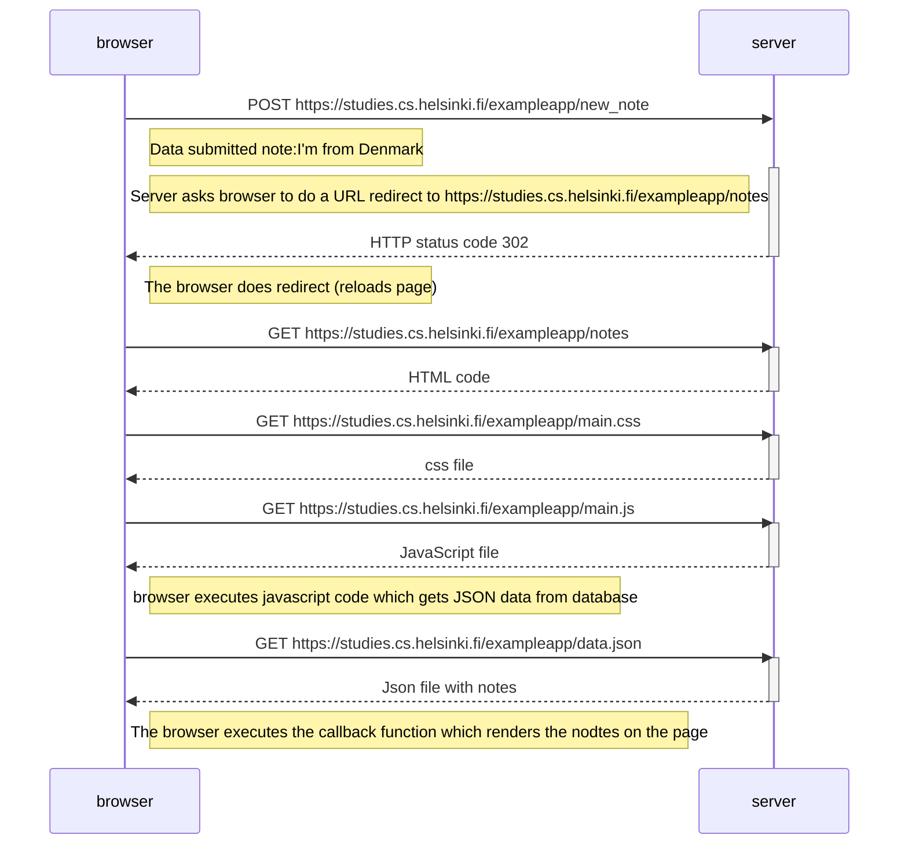

```mermaid

sequenceDiagram
    participant browser
    participant server

    browser->>server: POST https://studies.cs.helsinki.fi/exampleapp/new_note
    Note right of browser: Data submitted note:I'm from Denmark
    activate server
    Note left of server: Server asks browser to do a URL redirect to https://studies.cs.helsinki.fi/exampleapp/notes
    server-->>browser: HTTP status code 302
    deactivate server

    Note right of browser: The browser does redirect (reloads page)

    browser->>server: GET https://studies.cs.helsinki.fi/exampleapp/notes
    activate server
    server-->>browser: HTML code
    deactivate server

    browser->>server: GET https://studies.cs.helsinki.fi/exampleapp/main.css
    activate server
    server-->>browser: css file
    deactivate server

    browser->>server: GET https://studies.cs.helsinki.fi/exampleapp/main.js
    activate server
    server-->>browser: JavaScript file
    deactivate server

    Note right of browser: browser executes javascript code which gets JSON data from database

    browser->>server: GET https://studies.cs.helsinki.fi/exampleapp/data.json
    activate server
    server-->>browser: Json file with notes
    deactivate server

    Note right of browser: The browser executes the callback function which renders the nodtes on the page
```
